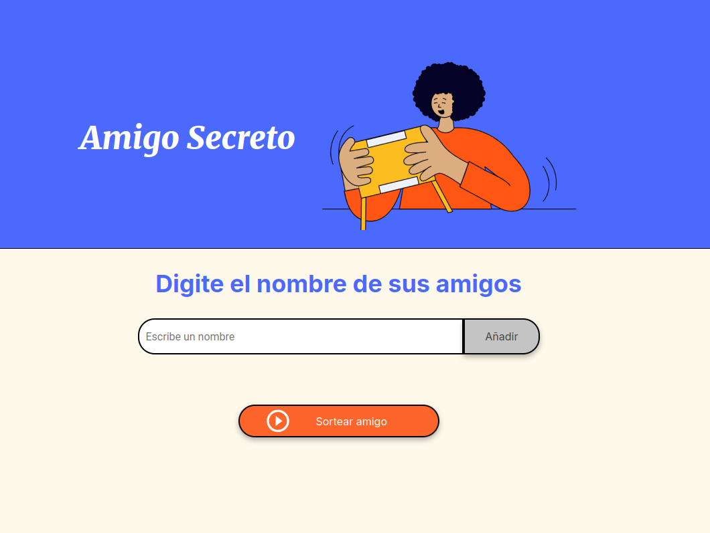

# 🎁 Juego Amigo Secreto

**Aplicación web interactiva para realizar sorteos tipo "Amigo Secreto".**  
Este proyecto fue desarrollado como parte de los cursos de **Oracle ONE** en colaboración con **Alura Latam**.

---

## 🖼️ Vista previa

🔗 [Probar la app en vivo](https://lcubero.github.io/Alura-ONE-challenge-amigo-secreto/)

---

## ✨ Características

- ✅ Agrega y visualiza una lista de participantes.
- 🔁 Evita nombres duplicados (no sensibles a mayúsculas).
- 🚫 Valida que los nombres no contengan símbolos ni números.
- 🎲 Sortea aleatoriamente un nombre de la lista.
- 🧼 Botón para reiniciar el sorteo y comenzar de nuevo.
- 💡 Interfaz simple, clara y fácil de usar.

---

## 🚀 ¿Cómo usar?

1. Escribe un nombre en el campo de entrada.
2. Haz clic en **"Añadir"** para agregarlo a la lista.
3. Una vez tengas al menos dos nombres, presiona **"Sortear amigo"**.
4. Se mostrará un nombre elegido al azar como el amigo secreto.
5. Usa el botón **"Reiniciar"** para borrar la lista y comenzar otro sorteo.

---

## 🛠️ Tecnologías utilizadas

- **HTML5** — estructura base de Alura Latam.
- **CSS3** — estilos base de Alura Latam.
- **JavaScript (Vanilla)** — lógica de validación, sorteo y DOM dinámico.

---

## 📚 Objetivo del proyecto

Este proyecto tiene fines **educativos** y fue creado para practicar:

- Manipulación de arrays
- Validación de formularios
- Interacción con el DOM
- Estructura semántica con HTML y estilos CSS

Forma parte del portafolio personal de aprendizaje en desarrollo Front-End.

---

## 📄 Licencia

Este proyecto se encuentra bajo una licencia abierta. Puedes modificarlo y reutilizarlo con fines educativos o personales.

---

## 🙌 Créditos

Desarrollado como parte del programa **Oracle ONE + Alura Latam** por [Luis Diego Cubero Chavarría](https://github.com/LCubero).  
El diseño de interfaz basado en las guías visuales de Alura.

---
